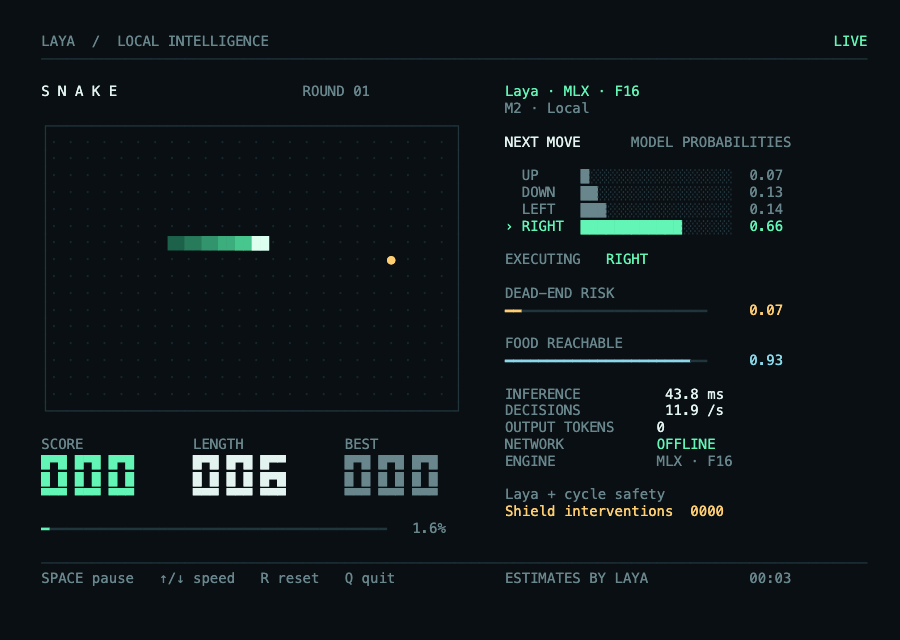

# Laya Snake (terminal: Node and Bun)

A faithful port of the laya-mlx Snake demo (`laya_mlx/snake/`,
`docs/SNAKE_DEMO.md`) to JavaScript. A real Snake game, driven by real Laya
predictions from [`@johnhenry/laya`](../../packages/laya) on **MLX**,
**WebGPU** (Dawn) or the CPU reference, in a truecolor ANSI terminal UI with
no dependencies.



## What is ported

| Python (`laya_mlx/snake/`) | Here (`src/`) |
|---|---|
| `game.py`: `hamiltonian_cycle`, `SnakeGame`, `moves()` safety rules, `food_reachability`, `cycle_order_valid` | `core/game.ts` |
| `random.Random(seed).choice` for food | `core/pyrandom.ts`: MT19937 + CPython `init_by_array` / `_randbelow`, so **the same seed gives the same foods** |
| `policy.py`: compact and detailed prompts, the 3 questions (`move` choice + `risk`/`food` noul), shield | `core/policy.ts` (`buildPrompt`, `LayaPolicy`, `decisionFrom`) |
| `cli.py` play loop, keys, `--record` JSONL (`laya-snake-v1`) | `cli.ts`, `core/session.ts`, `keyboard.ts` |
| `ui.py` fixed-cell layout (Rich) | `ui.ts` (the same canvas, rendered to 24-bit ANSI; `NO_COLOR` respected) |
| `benchmark.py` uncapped soak | `--episodes N --headless` |

`src/core/` has no Node imports. `examples/snake-web` imports it for the
browser version, and the package exports it as
`@johnhenry/example-snake-terminal/core`.

## Run

The default model is `aac6fef/laya-multilingual-mlx`, loaded **offline** from
the local Hugging Face cache, as the Python demo does. Download it once with
`hf download aac6fef/laya-multilingual-mlx`, or pass `--online`.

```bash
npm start -w @johnhenry/example-snake-terminal                 # node, backend auto (mlx on Apple silicon)
npm run start:bun -w @johnhenry/example-snake-terminal         # same under Bun
npm run dev -w @johnhenry/example-snake-terminal               # --max-speed
npm start -w @johnhenry/example-snake-terminal -- --backend webgpu --max-speed
npm run bench -w @johnhenry/example-snake-terminal             # 4 × 600 uncapped steps, seeds 101–104
# directly:
node --conditions=source src/cli.ts --backend mlx --headless --episodes 4 --steps 600 --seed 101
bun  --conditions=source src/cli.ts --backend webgpu --max-speed
```

Use a terminal of at least 104 × 35. Keys: **Space** pause, **↑/↓** (or
+/−) speed ±2/s, **R** next seed, **Q** or Ctrl-C quit.

Options: `--model <id|dir>`, `--backend auto|mlx|webgpu|cpu`,
`--dtype f16|f32`, `--prompt compact|detailed`, `--optimize` (16-token
buckets + prefix cache + compile), `--width/--height/--seed/--initial-length`,
`--fps`, `--max-speed`, `--duration`, `--steps`, `--unassisted`,
`--record run.jsonl`, `--headless`, `--episodes N`, `--no-alt-screen`,
`--online`.

`--episodes N --headless` runs N uncapped episodes (seeds `seed … seed+N−1`,
at most `--steps` each, default 600), checks the cycle-order invariant, and
prints a JSON summary. The summary has moves/s, deaths, interventions and
inference p50/p95 per episode and overall.

## Tests (`npm test` / `npm run test:bun`)

The oracle is Python's recorded run `laya-mlx/benchmarks/results/snake-showcase.jsonl`.
`test/fixtures/snake-showcase.head.jsonl` holds its first 40 frames, and
`test/fixtures/snake-prompts.json` is Python `Agent.prepare` output plus
fp16 predictions for those frames (`scripts/dump-snake-prompts.py`). Both
are regenerated by `npm run fixtures -w @johnhenry/example-snake-terminal`.

- `game.test.ts` ports `tests/test_snake.py`: cycle, collisions, board
  clear, 12 seeds of arbitrary shielded play to a full board, seed
  reproducibility, the shield. It also replays Python's executed moves and
  checks that every recorded board is identical (game + Python RNG), and that
  the safe set and planner-best match. Done once over the full recordings,
  all 2,440 frames of `snake-showcase` + `snake-fast` matched.
- `prompt.test.ts`: the state text and questions equal Python's exactly (key
  order too), prepared `ids`/`markers`/`qtype` deep-equal Python's
  `Agent.prepare`, and token counts equal the recorded `input_tokens`. Skips
  without the checkpoint in the HF cache.
- `agent.test.ts`: on the first 20 frames, real predictions stay within
  0.02 of Python fp16, and the shielded executed move equals the recorded
  one. `LAYA_SNAKE_BACKENDS=mlx,webgpu` (default `mlx`). Skips without the
  checkpoint, Apple silicon or a WebGPU adapter. Measured max |Δp|: **MLX
  0.0000** (identical to 4 decimals), **WebGPU 0.0015**.

## Measured (Apple M2, 10-core GPU; multilingual f16; uncapped, shielded; `~/gpu.lock` held)

4 episodes × 600 steps, seeds 101–104. This is the same protocol as Python's
`uncapped_soak`.

| runtime | backend | moves/s | inference p50 | deaths | interventions |
|---|---|---:|---:|---:|---:|
| Node 24.9 | MLX | 25.1 | 41.4 ms | 0 | 2 |
| Node 24.9 | MLX `--optimize` | 24.7 | 38.7 ms | 0 | 2 |
| Bun 1.2.17 | MLX | 23.1 | 42.6 ms | 0 | 2 |
| Node 24.9 | WebGPU (Dawn) | 7.4 | 131 ms | 0 | 2 |
| Bun 1.2.17 | WebGPU (Dawn) | 7.2 | 138 ms | 0 | 2 |
| Python 3.12 laya-mlx `laya-snake --headless --max-speed` | MLX | 23.0 | 42.8 ms (mean) | 0 | 2 |
| Python 3.12 laya-mlx, `--optimize` | MLX | 23.5 | 41.5 ms (mean) | 0 | 2 |

Python was run on the same machine, with the same seeds and step count, one
process per seed. The per-seed interventions match JS exactly (seed 101: 1,
102: 0, 103: 1, 104: 0), which is further evidence that the trajectories are
the same.

The machine was shared with other agents during these runs (load average
≈3.4), so expect ±30% noise. For reference, the laya-mlx docs report
63.6–75.4 moves/s on an M3 Max. Identical scores and interventions across
runtimes and backends show that the game is deterministic.

## Limits

- `--optimize` passes `padToMultiple: 16, cachePrompts: true, compile: true`
  to `load()`, so the gain depends on `@johnhenry/laya`'s support for each.
- No `export` (MP4/GIF) subcommand. `--record` writes the same
  `laya-snake-v1` JSONL, which Python's `laya-snake export` can render.
- The benchmark does not run the Python paced-rate sweep (`--rates`). Use
  `--fps` with `--duration` for paced runs.
- `--record` metadata has no Python-only fields (package versions, source
  hash).
