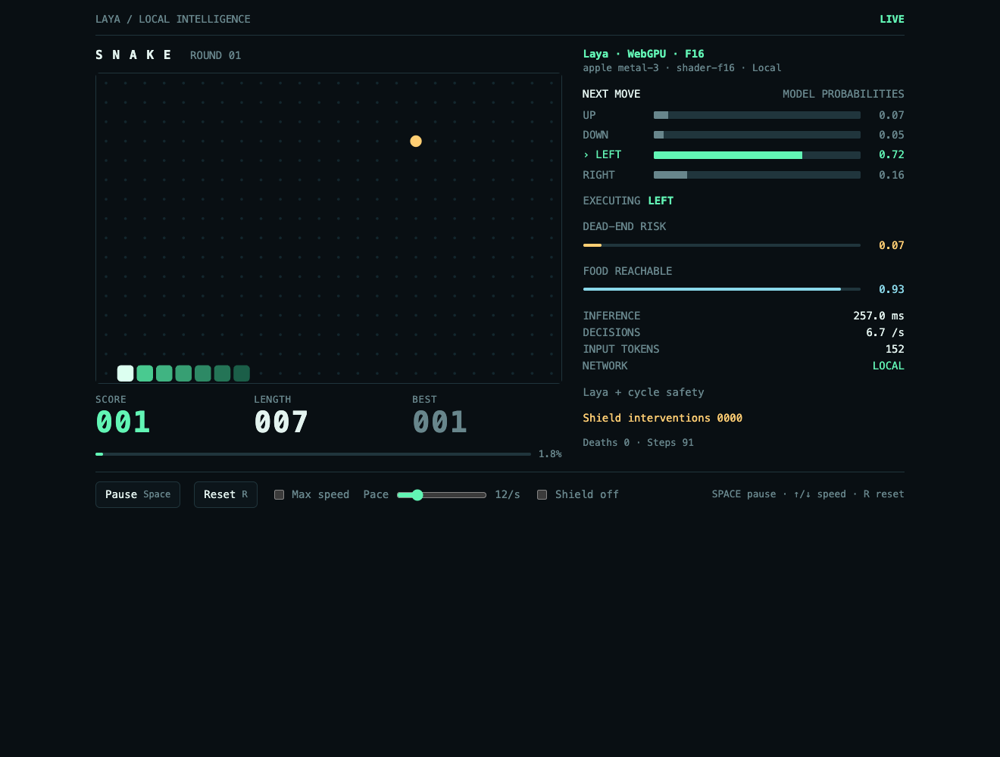

# Laya Snake (WebGPU, browser)

**Live:** <https://johnhenry.github.io/laya-js/snake/> (GitHub Pages, deployed from `main` by `.github/workflows/pages.yml`).

The [Snake demo](../snake-terminal) in the browser. The game, Hamiltonian
planner, cycle safety shield and the exact 3-question compact prompt are the
same code as the terminal demo: `../snake-terminal/src/core`, imported
relatively. The model runs through `@johnhenry/laya` on WebGPU in f16. The
board is drawn on a DPR-aware canvas, and the side panel follows the
terminal layout.



- **Board**: 24 × 16, seed 7, initial length 6, the same as Python. Round r
  uses seed + r − 1.
- **Side panel**: the four move probabilities (the model's raw output; the
  proposed move is marked), the executed move with a `SHIELD` tag when the
  shield overrode the model, dead-end risk (1 − P(safe route)), food
  reachable, inference ms, a live decisions/s counter (rolling 60
  decisions), input tokens, shield interventions, deaths and steps.
- **Controls**: Space pauses and resumes; ↑/↓ (or +/−) change the pace by
  2/s (1–60); R resets to the next seed. "Max speed" moves as soon as each
  inference completes. "Shield off" executes raw top-1, as Python's
  `--unassisted`, and stops at the first death until you press R or Space.
- A warmup of 6 decisions on seed + 10000 compiles the GPU pipelines, as the
  terminal demo does.

## Run

```bash
npm run dev -w @johnhenry/example-snake-web   # bun build → dist/, then serve http://localhost:5174/
npm run build -w @johnhenry/example-snake-web
npm start -w @johnhenry/example-snake-web
```

Open <http://localhost:5174/>, pick a checkpoint (Multilingual is the
default and the smallest) and press **Load & play**. The weights (≈644 MB)
download once from huggingface.co into the Cache API.

The build and serve scripts are shared with the playground
(`../web-playground/scripts/{build,serve}.ts`). The build fails if the
bundle references a Node-only or native module.

## Measured (Apple M2, Chromium, multilingual f16)

| mode | moves/s | inference (mean) | deaths | interventions |
|---|---:|---:|---:|---:|
| paced 12/s | 11.9 | 60 ms | 0 | 0 |
| max speed (20 s, 481 steps) | **16.6** | 60 ms | 0 | 0 |

These numbers are from the Claude browser pane without the GPU lock. Headless
Chrome ran slower on the same machine (~250 ms per decision, likely
background-tab throttling). No console errors.

## Limits

- WebGPU only. There is no CPU fallback in this demo, because at about 1 s
  per decision on the CPU it would not be a game. An unsupported browser
  gets an explanation.
- The Cache API is per origin, so locally weights cached by the playground
  (port 5173) are not reused here (port 5174). On GitHub Pages both demos
  share the `johnhenry.github.io` origin and one cached copy.
- The ≈60 ms per decision is WebGPU dispatch/encode bound, with 450+
  dispatches per forward (see backend-webgpu's README). MLX in Node reaches
  ~26–40 ms.
