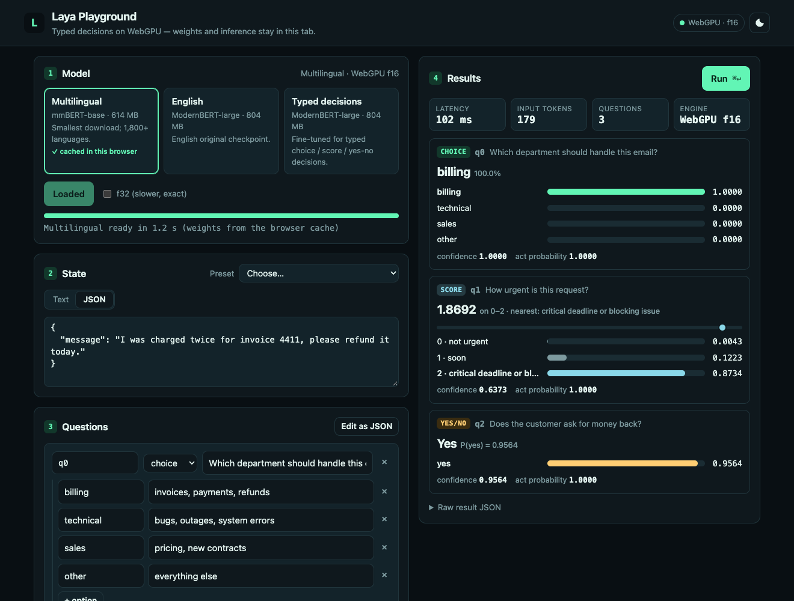

# Laya Playground (WebGPU, browser)

**Live:** <https://johnhenry.github.io/laya-js/playground/> (GitHub Pages, deployed from `main` by `.github/workflows/pages.yml`).

A single-page app that runs Laya typed decisions in the browser with
[`@johnhenry/laya`](../../packages/laya) on the WebGPU backend (f16 when the
adapter has `shader-f16`).



- **Checkpoint picker**: Multilingual (mmBERT-base, 644 MB, the smallest),
  English and Typed decisions (ModernBERT-large, 843 MB each).
- **Download progress**: weights come from
  `https://huggingface.co/<repo>/resolve/<commit>/…` through
  `@johnhenry/hf-cache`'s browser store (Cache API, cache name `hf-cache`).
  A reload loads from the cache (about 1 s instead of about 35 s), and the
  card shows "cached in this browser". "Clear cached weights" deletes them.
- **WebGPU detection**: explains a missing `navigator.gpu`, a missing adapter,
  or a non-secure context. Without `shader-f16`, the pill says "f32 only" and
  the f32 checkbox is ticked.
- **State editor**: plain text or JSON (objects go through Python-identical
  `json.dumps`, as in laya-mlx).
- **Question builder**: add choice, score and yes/no (`noul`) questions with
  criteria. Choice options can have descriptions, score levels are ordered,
  and yes/no questions have optional true/false meanings. You can also
  "Edit as JSON", which is sent verbatim so the agent's Python-compatible
  validation messages appear.
- **Presets**: the README triage example (the `en` case of the parity
  fixtures), a German variant and a plain-text example, plus every
  `*Questions()` export of `@johnhenry/laya-presets` when it has any.
- **Results**: a card per question with the verdict, a probability bar per
  option (score shows the expected value on a scale), confidence and act
  probability. Also shown: per-run latency, input tokens, question count and
  the engine. The raw JSON result is collapsible. Cmd/Ctrl+Enter runs.
- Accessible (labels, `role=meter` bars, `aria-live` results, focus rings,
  reduced motion) and responsive (one column below 900 px), with light, dark
  and system themes.

## Run

```bash
npm run dev -w @johnhenry/example-web-playground    # bun build → dist/, then serve http://localhost:5173/
# or step by step
npm run build -w @johnhenry/example-web-playground  # bun scripts/build.ts
npm start -w @johnhenry/example-web-playground      # node scripts/serve.ts dist --port 5173
```

Open <http://localhost:5173/> in Chrome or Edge 113+ (f16 needs 120+), or
Safari 26. `localhost` is a secure context, so WebGPU and the Cache API
work. Serving it from another host needs https.

The build uses Bun's bundler (`scripts/build.ts`, conditions `browser` +
`source`, so workspace packages are bundled from `src/`). It then **fails if
the bundle references a Node-only or native module**, such as
`node:*`/`fs`/`child_process` imports, `koffi`, `bun:ffi`,
`@johnhenry/backend-mlx` or the Dawn addon.

`scripts/serve.ts` is a dependency-free static server (Node or Bun). The
snake-web example reuses both scripts.

### GitHub Pages

`node scripts/build-pages.mjs` (from the repo root) builds this app and
snake-web and assembles `_site/` (`/` landing page, `/playground/`,
`/snake/`). `.github/workflows/pages.yml` runs it on every push to `main`
and deploys to <https://johnhenry.github.io/laya-js/>. Every asset URL is
relative (`./main.js`, relative chunk imports), so the `/laya-js/` prefix
needs no configuration; the script fails if an HTML or CSS file uses a
root-absolute URL. Weights still come from huggingface.co, whose `resolve`
URLs and CDN redirects send `access-control-allow-origin` for any origin.

## Verified (Apple M2, Chromium in the Claude browser pane and headless Chrome)

- Multilingual download 647 MB in 34–38 s, and 1.1 s from the cache after a reload.
- README triage example: every probability, score, noul, confidence and act
  probability is within **3e-4** of the Python fp16 fixture
  (`packages/laya-fixtures/data/real/multilingual.json`, case `en`), with 179
  input tokens (identical).
- Latency for 3 questions and one batch: about 700 ms on the first run
  (pipeline compilation), then 70–100 ms.
- No console errors.

## Limits

- The Cache API is per origin. Locally, the playground (port 5173) and
  snake-web (port 5174) each keep their own copy of the weights; on GitHub
  Pages both live on `johnhenry.github.io` and share one copy.
- The first run after loading compiles the WebGPU pipelines.
- A downloaded file is buffered into a Blob before it is cached (see
  hf-cache's limitations), so the browser briefly needs about the checkpoint
  size in memory.
- The native MLX backend is not available in browsers.
